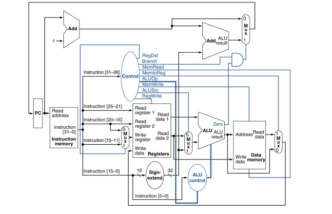

# vhdl_mips_cpu
An implementation of the Mips processor in the vhdl language

A simple change that was made was changing the number added to the program counter on every step from 4 to 1.
Hence we are treating the memory as chunks of 32 instead of chunks of 8 (1 byte).
As a of this was the removal of a shift 2 left register before the second adder pointing to the mux that points to the program counter.

The implementation was made using the following schematic:

